<div align="center">

# Aakaro

### Give your idea an identity.

An AI-assisted branding workspace that turns a rough idea into a strategy, name, visual direction, brand system and rule-aware content review — while keeping every major decision in the user's hands.

**[Live Demo](https://aakaro.vercel.app)** · [Product Walkthrough](#product-walkthrough) · [Tech Stack](#tech-stack) · [Architecture](#architecture)


</div>

> [!IMPORTANT]
> **Live demo note**
> The frontend is deployed on Vercel, while the API runs on Render's free tier. The backend may spin down after inactivity, so the first request can take around 30–60 seconds to wake up. If a request times out, please wait briefly and retry. The complete product flow is also documented with screenshots below.

**Demo:** https://aakaro.vercel.app — API: https://aakaro-api.onrender.com

**Core principle:** _AI assists the decision. The user makes the decision._

---

## Contents

- [Why Aakaro?](#why-aakaro)
- [The complete journey](#the-complete-journey)
- [Product walkthrough](#product-walkthrough)
  - [01 — Start with the idea](#ch-01)
  - [02 — Turn answers into strategy](#ch-02)
  - [03 — Explore names without losing reasoning](#ch-03)
  - [🪦 The Graveyard](#graveyard)
  - [05 — Compare two brand directions](#ch-05)
  - [06 — Turn the direction into a brand system](#ch-06)
  - [07 — Brand Rules](#ch-07)
  - [08 — Brand Spellcheck](#ch-08)
- [What makes Aakaro different](#what-makes-aakaro-different)
- [Human-in-the-loop design](#human-in-the-loop-design)
- [Architecture](#architecture)
- [Tech stack](#tech-stack)
- [MVP features](#mvp-features)
- [Demo & development mode](#demo-and-development-mode)
- [Run locally](#run-locally)
- [Testing](#testing)
- [Deployment](#deployment)
- [Project status](#project-status)
- [Built in 24 hours](#built-in-24-hours)

---

## Why Aakaro?

Building a product is one challenge. Deciding what it stands for, what to call it, how it should look and how it should sound is another.

Early-stage builders usually end up jumping between:

- AI chats
- naming generators
- design tools
- scattered notes
- random color palettes

Each tool produces an output, but none of them remembers **why** a decision was made. The result is fragmented work with little continuity: a name that no longer matches the strategy, a palette that fights the voice, feedback with no rule behind it.

**Aakaro keeps those decisions connected.** One workspace, one sequence of confirmed decisions, each stage inheriting the last one instead of starting over.

---

## The complete journey

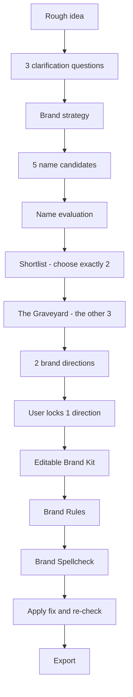

Each stage uses confirmed decisions from the previous stage, so the brand evolves instead of being regenerated from scratch.

---

## Product walkthrough

> [!NOTE]
> The screenshots below were captured from the running product using Aakaro's deterministic development provider. Aakaro includes a deterministic mock provider for reliable development, testing and demonstrations, while maintaining the same structured provider contract used by the AI integration. Mock-generated text is labelled as such inside the product (for example _"Mock strategy for development."_, _"(Mock evaluation)"_, _"(Mock review)"_).

<a id="ch-01"></a>

### 01 — Start with the idea

Aakaro asks **only three focused clarification questions** instead of forcing users through a long onboarding form. Each question explains why it is being asked, answers save as you type, and every answer can be revised before the strategy is locked.

<table>
  <tr>
    <td width="50%" align="center">
      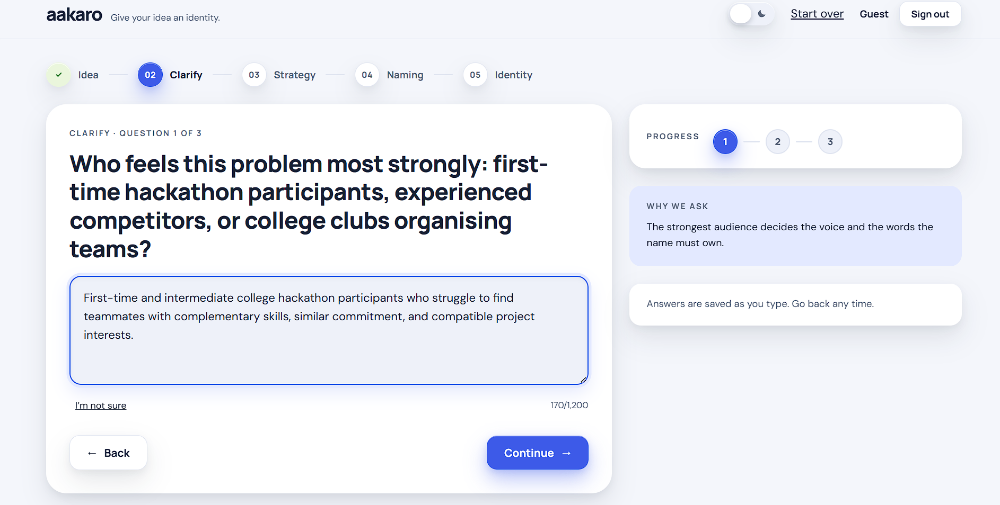
      <p align="center"><sub><b>Audience</b><br />"What audience feels the problem most strongly?"</sub></p>
    </td>
    <td width="50%" align="center">
      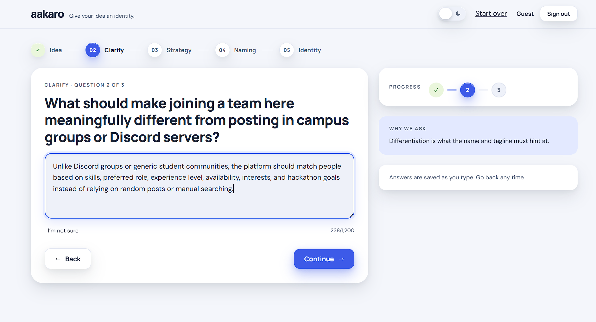
      <p align="center"><sub><b>Differentiation</b><br />"What makes this product meaningfully different?"</sub></p>
    </td>
  </tr>
</table>

<p align="center">
  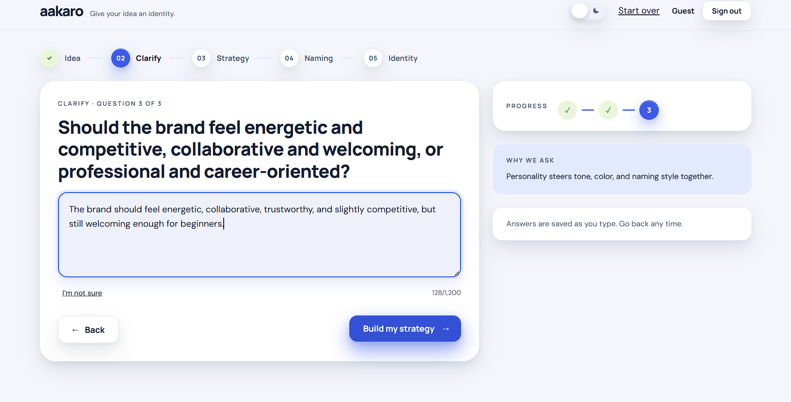
  <br />
  <sub><b>Personality</b> — "How should the brand feel?" — the third and final question before strategy generation.</sub>
</p>

<a id="ch-02"></a>

### 02 — Turn answers into strategy

The answers become a structured brief the user can read, edit tile by tile, and only then lock:

- one-liner
- audience
- problem
- positioning
- promise
- personality
- differentiation
- naming territories

<p align="center">
  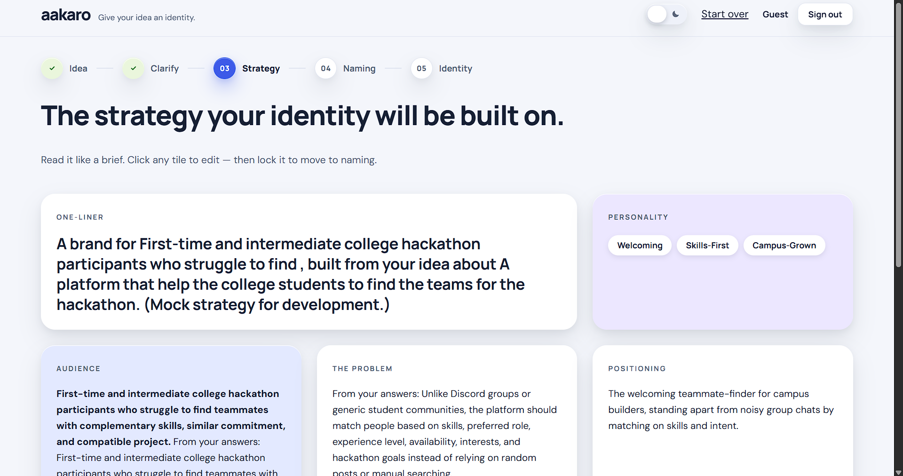
  <br />
  <sub><b>The strategy brief</b> — "Read it like a brief. Click any tile to edit — then lock it to move to naming."</sub>
</p>

<p align="center">
  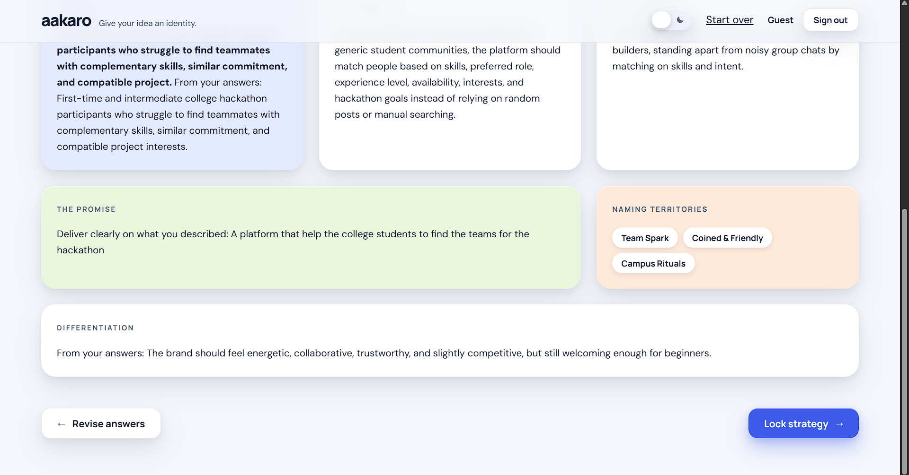
  <br />
  <sub><b>Review before commitment</b> — promise, differentiation and naming territories, with <b>Revise answers</b> still available.</sub>
</p>

Nothing continues downstream until the user explicitly locks it:

<p align="center">
  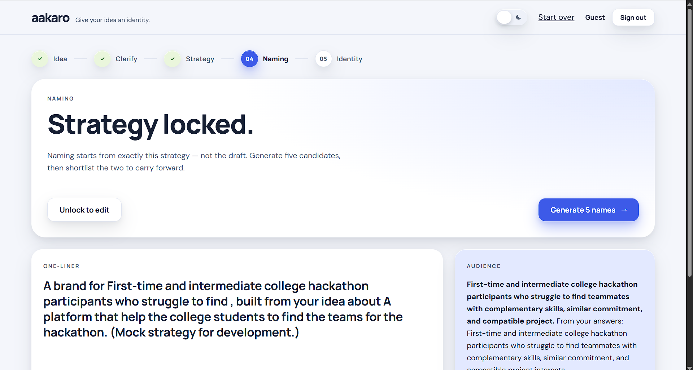
  <br />
  <sub><b>Strategy locked</b> — "Naming starts from exactly this strategy — not the draft." The lock can be undone to edit.</sub>
</p>

<a id="ch-03"></a>

### 03 — Explore names without losing reasoning

Aakaro generates five candidates and evaluates them against a consistent set of dimensions:

- distinctiveness
- strategic fit
- memorability
- extensibility
- strengths
- risks

<p align="center">
  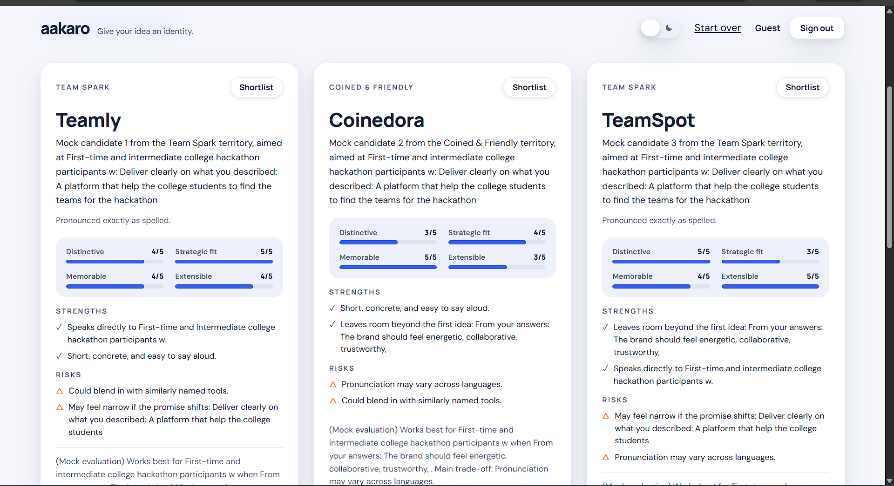
  <br />
  <sub><b>Name evaluation</b> — every candidate carries its own scores, strengths, risks and verdict.</sub>
</p>

The scores are **structured decision support**: a shared frame that makes five very different names comparable side by side. They are not a scientifically objective ranking, and Aakaro never picks a winner for you.

<a id="graveyard"></a>

### 🪦 The Graveyard

> Most naming tools discard rejected options. Aakaro keeps them.

The user shortlists **exactly 2 of the 5** names. The remaining **3 enter The Graveyard** — together with the evaluation and the reasons they were rejected.

<p align="center">
  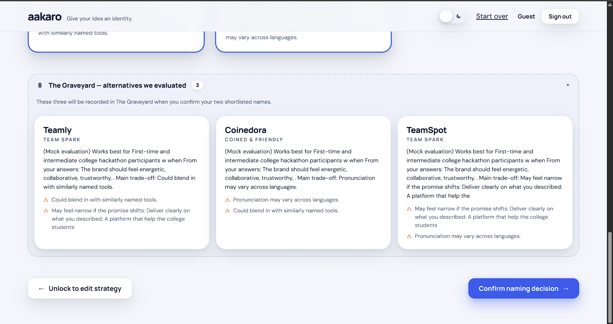
  <br />
  <sub><b>The Graveyard — alternatives we evaluated.</b> The three names not shortlisted stay visible, with the trade-offs recorded next to them.</sub>
</p>

That prevents teams from:

- repeating old naming discussions
- forgetting **why** a name was dropped
- losing the exploration history that led to the final choice

Rejection here means "not right for this brief" — not "bad name". The record stays attached to the project for as long as the project does.

<a id="ch-05"></a>

### 05 — Compare two brand directions

Each shortlisted name receives its own distinct direction before anything is locked:

<p align="center">
  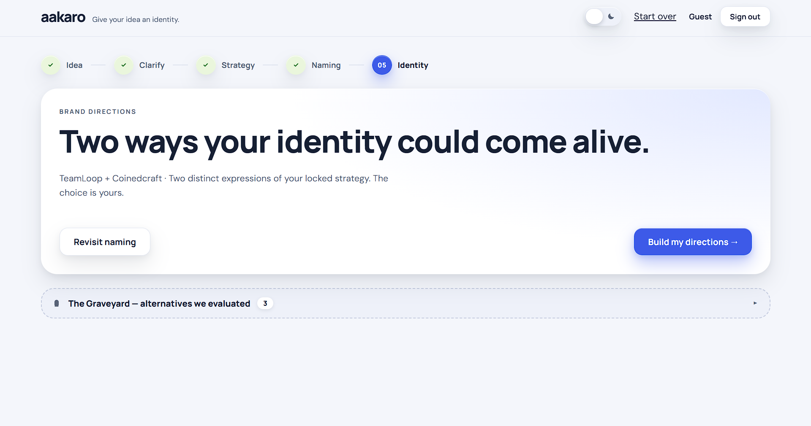
  <br />
  <sub><b>Two ways your identity could come alive</b> — "Two distinct expressions of your locked strategy. The choice is yours."</sub>
</p>

<table>
  <tr>
    <td width="50%" align="center">
      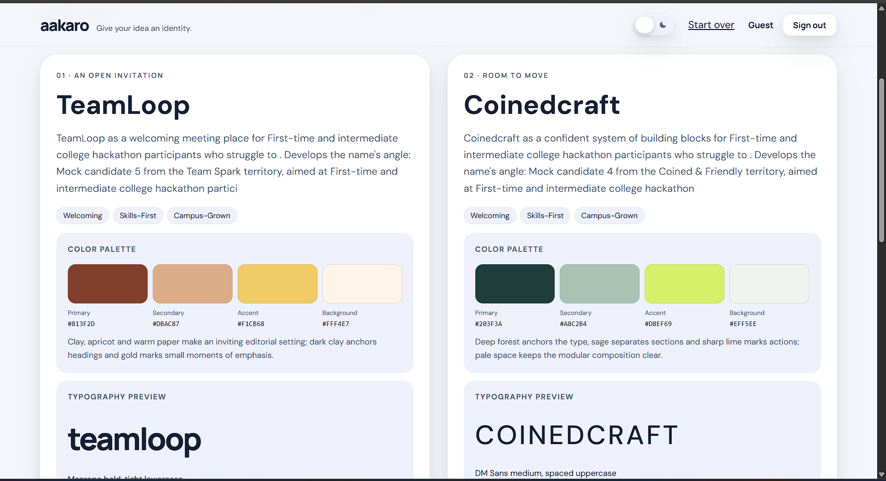
      <p align="center"><sub>Both directions at a glance — palette, typography and the idea behind each name.</sub></p>
    </td>
    <td width="50%" align="center">
      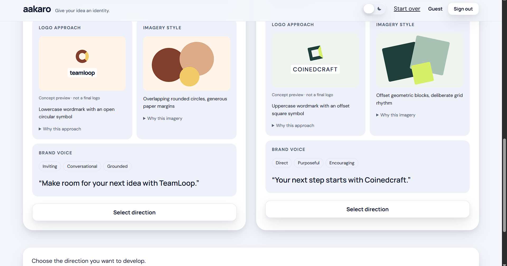
      <p align="center"><sub>Direction details — logo approach, imagery style and brand voice.</sub></p>
    </td>
  </tr>
</table>

Each direction covers **palette, typography, logo approach, imagery style and brand voice**. The user compares both and locks one.

> Aakaro does not tell the user which identity is "best". The final direction remains a human decision.

<a id="ch-06"></a>

### 06 — Turn the direction into a brand system

<p align="center">
  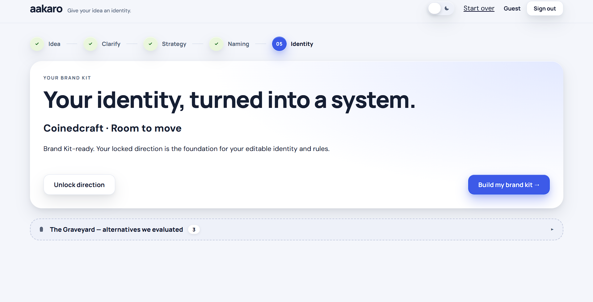
  <br />
  <sub><b>Brand Kit-ready</b> — "Your locked direction is the foundation for your editable identity and rules."</sub>
</p>

The Brand Kit contains:

- final confirmed name
- tagline
- descriptor
- colours
- typography
- wordmark treatment
- imagery guidance
- voice traits
- preferred language
- avoided language
- explicit **Brand Rules**

<table>
  <tr>
    <td width="50%" align="center">
      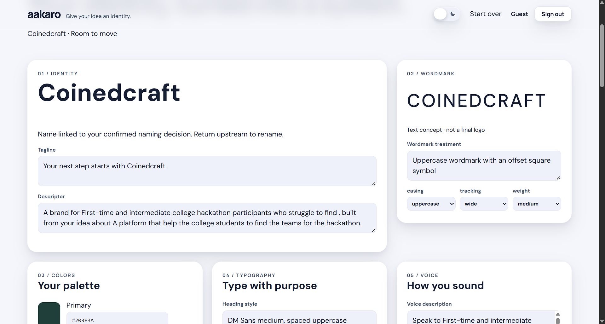
      <p align="center"><sub><b>Identity &amp; wordmark</b> — every field is editable.</sub></p>
    </td>
    <td width="50%" align="center">
      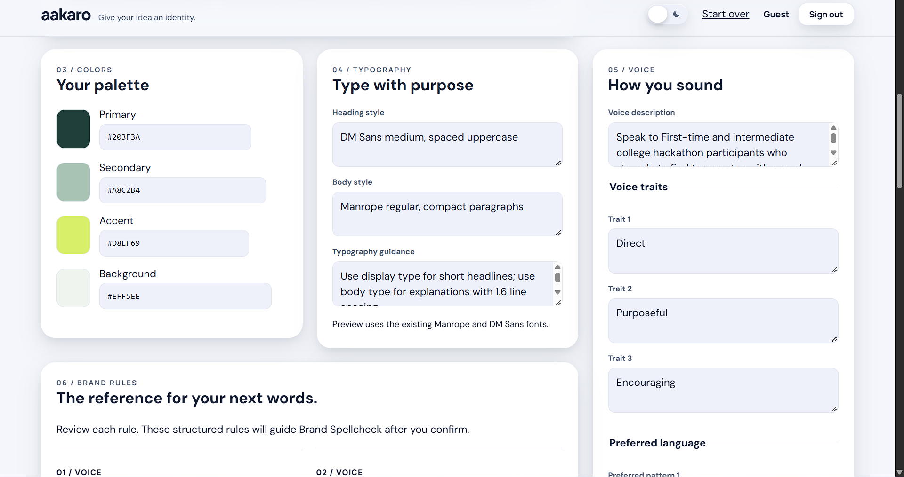
      <p align="center"><sub><b>Colours, typography, voice and the Brand Rules panel.</b></sub></p>
    </td>
  </tr>
</table>

Every field stays editable, and the live preview updates from the **same brand-system data** the rest of the product reads — not a separate mock-up.

<p align="center">
  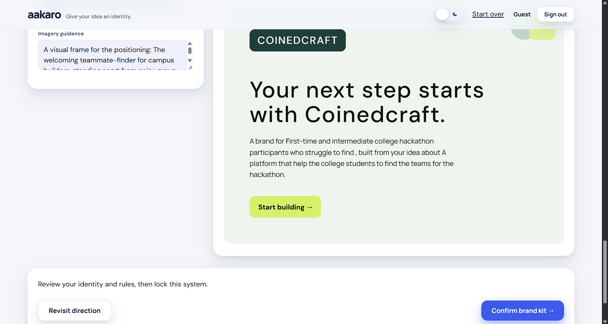
  <br />
  <sub><b>Live preview</b> — wordmark, tagline and descriptor rendered from the confirmed brand system.</sub>
</p>

<a id="ch-07"></a>

### 07 — Brand Rules

The Brand Kit does not stop at pretty visuals.

From the approved identity, Aakaro derives **6–10 structured rules** — explicit statements about voice, language, messaging and visual behaviour (for example, phrases the brand avoids, or how headlines should be written).

Those rules are stored with stable IDs and become **machine-readable inputs for Brand Spellcheck**. That is the bridge between "a nice-looking brand kit" and "content that is actually checked against it" — and it is one of Aakaro's clearest architectural differentiators.

<a id="ch-08"></a>

### 08 — Brand Spellcheck

Users paste the content they are about to publish — landing-page copy, posts, announcements, product descriptions, campaign copy — and Aakaro checks it **against the rules the user actually approved**.

<p align="center">
  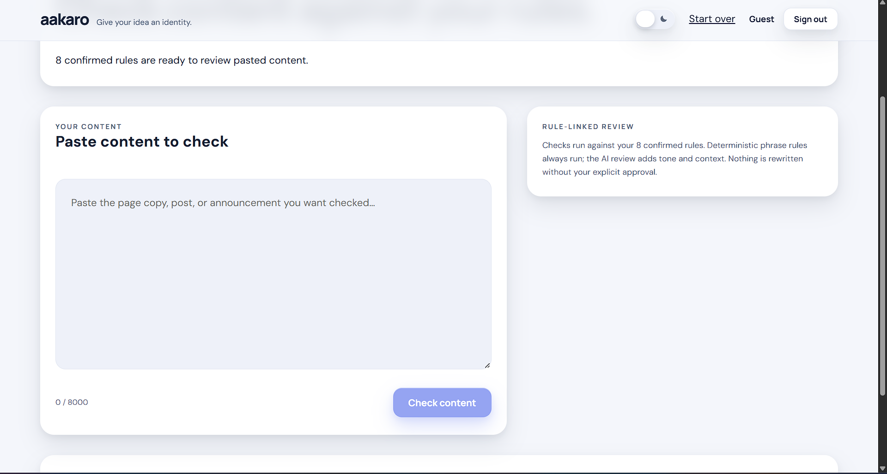
  <br />
  <sub><b>Paste and check</b> — "Checks run against your 8 confirmed rules… Nothing is rewritten without your explicit approval."</sub>
</p>

Every issue is presented as one traceable chain:

**Issue → Exact Rule → Why → Suggestion → User chooses Apply Fix**

<p align="center">
  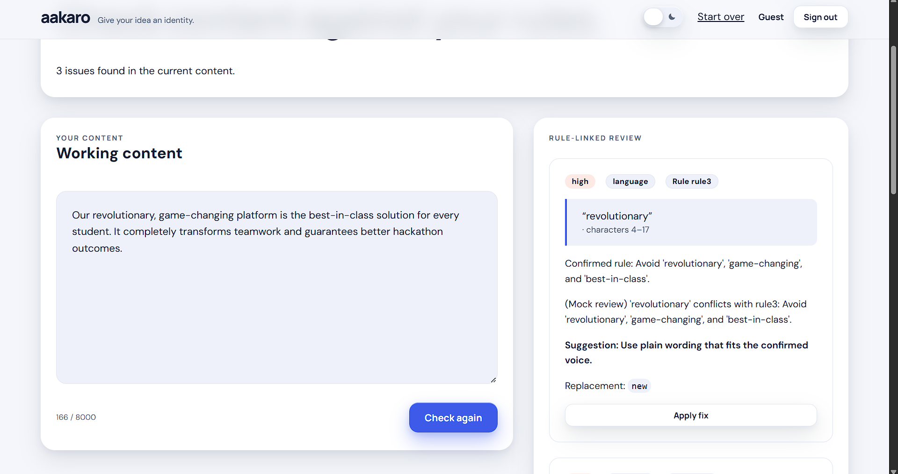
  <br />
  <sub><b>Rule-linked review</b> — the flagged word <b>"revolutionary"</b> is traced to the exact confirmed rule: <i>"Avoid 'revolutionary', 'game-changing', and 'best-in-class'."</i></sub>
</p>

- the **original content is preserved** — pasted text stays intact as a separate original
- fixes modify **working content only**
- the user must **explicitly apply** a suggestion; nothing changes silently
- after edits the review becomes **stale** and can be re-run against the latest content
- deterministic phrase checks always run; AI review adds tone and context, labelled honestly

---

## What makes Aakaro different

| Typical AI branding tool | Aakaro |
| --- | --- |
| Generates disconnected outputs | Maintains one connected brand workflow |
| AI selects or recommends | Human explicitly confirms major decisions |
| Rejected names disappear | Graveyard preserves them |
| Brand kit is mostly visual | Brand kit includes structured rules |
| Generic writing feedback | Issues link to exact brand rules |
| AI silently rewrites | Original content remains intact |

---

## Human-in-the-loop design

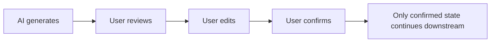

Nothing moves forward on the AI's authority alone. Generation produces a **draft**; the user reviews it, edits it, and confirms it. Only the confirmed state is consumed by the next stage.

Because every stage consumes confirmed state, **editing upstream invalidates dependent downstream work** instead of leaving it quietly out of date:

```
Strategy changes
  → Naming invalidated
  → Directions invalidated
  → Brand Kit invalidated
  → Spellcheck review invalidated
```

<details>
<summary><b>How project-state invalidation works</b></summary>

<br />

The frontend keeps one canonical project object with a monotonically increasing `revision`. Every stage result is committed only if it arrives with the revision and stage the request was started from — so a late or out-of-order response can never overwrite newer state.

When an upstream decision changes:

- editing the idea or unlocking the strategy clears naming, directions, the brand kit and spellcheck
- re-selecting a name or direction clears everything built from the previous selection
- editing content or rules marks the last review **stale** rather than silently reusing it
- AI requests are also aborted on unmount/sign-out, and stale responses are rejected

The user always re-confirms the next stage; nothing downstream pretends to still be valid.

</details>

---

## Architecture

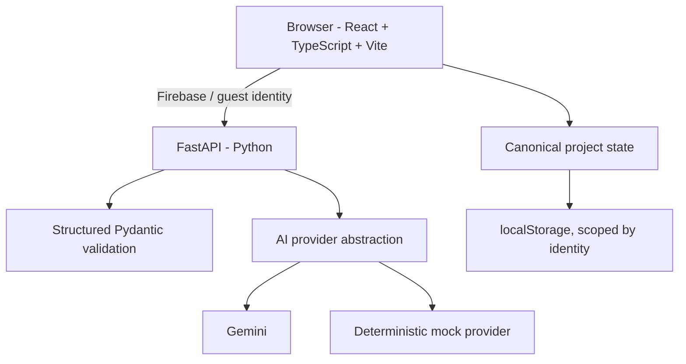

Design notes:

- **Structured AI responses** — provider output is validated against strict Pydantic schemas before it reaches the product; invalid output triggers one bounded schema-repair attempt, then a safe error.
- **Pydantic validation** — request and response contracts are shared and enforced between Python and TypeScript.
- **Stale request / revision guards** — late or out-of-order responses cannot commit over newer state.
- **Deterministic mock provider** — same provider contract as the Gemini path, used for development, tests and demos.
- **Explicit state invalidation** — upstream edits clear or stale-mark dependent downstream work.
- **Backend API boundaries** — identity verification, rate limiting and provider calls stay server-side; secrets never reach the browser.

<details>
<summary><b>Canonical project state and persistence</b></summary>

<br />

The frontend stores one active project in browser `localStorage`, keyed by the signed-in identity (`aakaro:v1:<uid>:active-project`). Corrupt payloads are backed up rather than silently deleted, and a guest session gets its own scoped key.

This is **local recovery, not cloud backup** — the project follows the browser and identity it was created with.

</details>

---

## Tech stack

| Layer | Technology |
| --- | --- |
| Frontend | React, TypeScript, Vite |
| Backend | FastAPI, Python, Pydantic |
| Authentication | Firebase architecture + guest/demo access |
| AI | Gemini-compatible structured provider + deterministic mock provider |
| Hosting | Vercel (frontend) + Render (backend) |
| Persistence | Browser `localStorage`, scoped by identity |

---

## MVP features

- [x] Guided idea clarification
- [x] Editable strategy generation
- [x] Five-name exploration
- [x] Structured name evaluation
- [x] Two-name shortlist
- [x] Graveyard
- [x] Dual Brand Directions
- [x] Editable Brand Kit
- [x] Brand Rules
- [x] Live identity preview
- [x] Brand Spellcheck
- [x] Rule-linked feedback
- [x] Apply Fix + Re-check
- [x] Markdown export
- [x] Print / Save PDF
- [x] Guest demo access
- [x] Light / dark UI

---

<a id="demo-and-development-mode"></a>

## Demo & development mode

Aakaro ships with a **deterministic mock provider** alongside the Gemini-compatible provider. It is used for:

- reliable demonstrations
- frontend development
- automated testing
- quota-independent workflows

It follows the **same structured contracts** expected by the AI pipeline — same schemas, same validation, same code paths — so the product behaves identically with or without live credentials.

> Aakaro includes a deterministic mock provider for reliable development, testing and demonstrations, while maintaining the same structured provider contract used by the AI integration.

Mock-generated text is always labelled in the interface. Real AI configuration depends on deployment credentials/environment; mock output is never presented as live Gemini output.

<details>
<summary><b>Provider selection details</b></summary>

<br />

- `MOCK_PROVIDER_ENABLED=true` — deterministic offline stand-in (no API quota consumed).
- `MOCK_PROVIDER_ENABLED=false` — live Gemini calls using `GEMINI_API_KEY` / `GEMINI_MODEL`.

Provider selection is independent of authentication: both modes work with Firebase sign-in and with guest/demo access. Production deployments set `MOCK_PROVIDER_ENABLED=false`.

</details>

---

## Run locally

Prerequisites: Node.js, Python 3.11+ and [`uv`](https://docs.astral.sh/uv/).

**Backend**

```bash
cd backend
uv sync --frozen
uv run uvicorn app.main:create_app --factory --reload --host 127.0.0.1 --port 8000
```

**Frontend**

```bash
cd frontend
npm ci
npm run dev
```

Open **http://localhost:5173**

<details>
<summary><b>Environment variables (names only — see <code>.env.example</code> files)</b></summary>

<br />

Copy the templates once:

```bash
cp backend/.env.example backend/.env
cp frontend/.env.example frontend/.env.local
```

**Backend** (`backend/.env`)

```
GEMINI_API_KEY
GEMINI_MODEL
FIREBASE_PROJECT_ID
GOOGLE_APPLICATION_CREDENTIALS
CORS_ORIGINS
PROVIDER_TIMEOUT_SECONDS
USER_REQUEST_LIMIT
USER_WINDOW_SECONDS
CONNECTION_TEST_ENABLED
DEV_AUTH_ENABLED
MOCK_PROVIDER_ENABLED
```

**Frontend** (`frontend/.env.local`)

```
VITE_API_BASE_URL
VITE_FIREBASE_API_KEY
VITE_FIREBASE_AUTH_DOMAIN
VITE_FIREBASE_PROJECT_ID
VITE_FIREBASE_APP_ID
VITE_DEV_AUTH_BYPASS
```

The `.env.example` files are the source of truth. Never commit real `.env` files, service-account JSON or API keys; Gemini and Firebase Admin credentials stay server-side.

Keep the `localhost` origin consistent with `CORS_ORIGINS` — `127.0.0.1:5173` and `localhost:5173` are different origins.

</details>

<details>
<summary><b>Development-only flags for the repeatable demo</b></summary>

<br />

- Backend: `DEV_AUTH_ENABLED=true`, `MOCK_PROVIDER_ENABLED=true`
- Frontend: `VITE_DEV_AUTH_BYPASS=1`

These are development-only, default-off, and cannot be enabled in a production build. The UI labels mock mode explicitly — it is never presented as live Gemini output.

</details>

---

<a id="testing"></a>

## Testing

Verified totals:

| Suite | Command | Result |
| --- | --- | --- |
| Backend | `uv run pytest -q` | **124 passed** |
| Frontend types | `npm run typecheck` | **passed** |
| Frontend unit | `npm test` | **58 passed** (8 files) |
| Frontend build | `npm run build` | **passed** |

Automated coverage includes:

- canonical project state, persistence and stage invalidation
- AI response validation (strict schemas, bounded schema repair)
- stale-response / revision-guard protection
- naming generation, shortlist and Graveyard partition
- Brand Directions generation and selection
- Brand Kit editing, palette validation and confirmation
- Brand Spellcheck: rule-linked issues, Apply Fix, stale re-check
- guest / auth behaviour and identity separation

<details>
<summary><b>Test commands</b></summary>

```bash
# backend
cd backend
uv run pytest -q

# frontend
cd frontend
npm run typecheck
npm test
npm run build
```

</details>

---

## Deployment

| Service | URL |
| --- | --- |
| Frontend (Vercel) | https://aakaro.vercel.app |
| Backend (Render) | https://aakaro-api.onrender.com |

The frontend is a static Vite build on Vercel; the FastAPI service runs on Render. The backend currently runs on Render's **free tier**, so it may spin down after inactivity and the first request can take 30–60 seconds to wake it up — see the note at the top of this README.

---

## Project status

**Core MVP: complete.** The full idea → strategy → naming → Graveyard → directions → brand kit → rules → spellcheck → export journey works end to end.

Current priorities:

- production AI credentials
- production auth refinement
- deployment reliability
- future persistence beyond browser-local state

<details>
<summary><b>Known limitations</b></summary>

- Project persistence is browser-local and scoped to one identity per browser — not cloud backup.
- Names are suggestions only: no availability, trademark, cultural-clearance or competitor research is performed.
- Brand previews are fixed text-and-shape concepts, not final logos or deployed websites.
- Print / Save as PDF uses the browser print flow.
- Scores and evaluations are structured decision support, not objective measurement.

</details>

---

<a id="built-in-24-hours"></a>

## Built in 24 hours ⚡

Aakaro was designed and built during a 24-hour hackathon, with the focus placed on shipping **one coherent end-to-end product** rather than a collection of disconnected AI demos.

See [DEMO.md](DEMO.md) for the repeatable demo script.

---

<div align="center">

Built with curiosity, too much coffee, and one question:

**What if AI helped you make brand decisions without taking those decisions away from you?**

**Aakaro — Give your idea an identity.**

</div>
